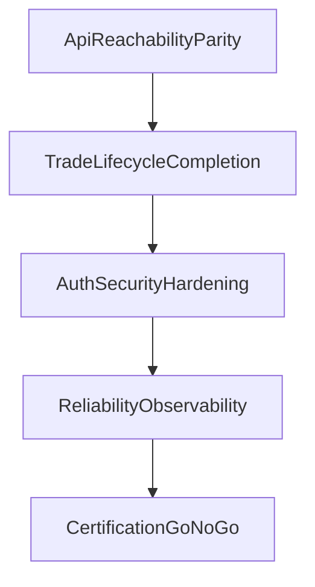

# OpenClaw Move-In Sprint Plan

## Objective

Complete backend/frontend/integration work required for OpenClaw to fully operate inside Pulse with reliable proposal, approval, and execution flows.

## Sprint 1 — API Reachability and Parity

### Tasks

1. Register autopilot routes in `backend-hono/src/routes/index.ts`.
2. Align frontend service paths with mounted backend endpoints.
3. Replace move-in-critical frontend stubs in `frontend/lib/services.ts` where backend parity exists.

### Exit Criteria

- Autopilot endpoints are reachable.
- Frontend calls no longer rely on stubs for critical workflow paths.

## Sprint 2 — Trade Lifecycle Completion

### Tasks

1. Replace simulated execution in `backend-hono/src/services/autopilot/proposal-service.ts` with ProjectX-backed execution.
2. Replace mock position flow in `backend-hono/src/services/trading-service.ts`.
3. Ensure proposal -> approval -> execution -> persisted result chain is complete.

### Exit Criteria

- One full proposal-to-execution flow passes end to end against real execution stack (or isolated paper-trade equivalent).

## Sprint 3 — Auth and Security Hardening

### Tasks

1. Move backend from local-user middleware mode to production token/session verification path.
2. Align frontend API token injection path where required.
3. Keep local dev fallback mode explicitly environment-gated.

### Exit Criteria

- Protected routes enforce production auth behavior in production profile.

## Sprint 4 — Reliability and Observability

### Tasks

1. Wire structured logging and error capture in backend bootstrap.
2. Remove hardcoded placeholders in RiskFlow context fields.
3. Validate boardroom/OpenClaw runtime behavior outside local-only assumptions.

### Exit Criteria

- Proposal and execution failures are traceable via logs/telemetry with request correlation.

## Sprint 5 — Certification and Go/No-Go

### Test Matrix

- Feed ingestion and rendering
- AI chat request/response
- Boardroom messaging relay
- Proposal generation
- Human acknowledgment
- Order execution
- Position and PnL sync

### Exit Criteria

- Full matrix pass with no critical blockers.
- Go-live checklist approved.

## Dependency Flow

