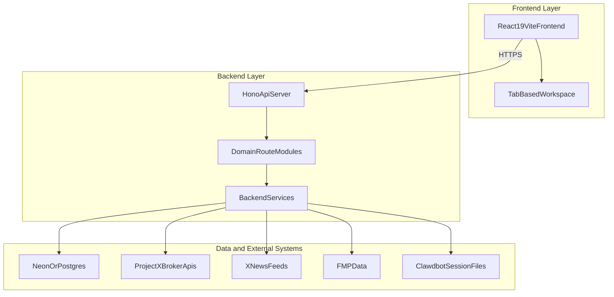

# Pulse v3 Architecture (Updated)

> Version: 3.x (active implementation stream)  
> Status: Implemented with known gaps  
> Last Updated: 2026-02-12

## System Overview

Pulse is a React + Hono trading operations platform with boardroom communication, RiskFlow intelligence, and proposal-driven trade workflows.

## Frontend Architecture

- Runtime: React 19 + Vite + TypeScript.
- Navigation is state-based tab switching (not URL-router based).
- Major surfaces: Feed, Analysis, News, Executive, Boardroom/Chatroom, Notion Research, Settings.
- Integration points live in `frontend/lib/apiClient.ts` and `frontend/lib/services.ts`.

## Backend Architecture

- Runtime: Node 20, Hono server (`backend-hono/src/index.ts`).
- Central route registration in `backend-hono/src/routes/index.ts`.
- Service modules for riskflow, boardroom, trading, projectx, ai, agents, psych, notifications.
- Data path through Neon serverless or local `pg` pool in `backend-hono/src/config/database.ts`.

### Mounted route groups

- `/api/market`
- `/api/boardroom`
- `/api/account`
- `/api/notifications`
- `/api/trading`
- `/api/projectx`
- `/api/riskflow`
- `/api/psych`
- `/api/ai`
- `/api/agents`
- `/api/polymarket`

### Present but not mounted

- `/api/autopilot` module exists but is not registered in `routes/index.ts`.

## Move-In Critical Gaps

1. Autopilot route registration and endpoint reachability.
2. Real order execution replacement for simulated execution paths.
3. Endpoint parity for frontend stubbed methods (ER/events/NTN-related wrappers).
4. Production auth hardening (current middleware uses local single-user context).
5. Observability baseline wiring for proposal/execution lifecycle.

## Auth and Security Reality

- Current backend middleware is local single-user mode for protected routes.
- Clerk packages/config exist in codebase, but production enforcement path is pending.

## Deployment Model

- Frontend: Vercel.
- Backend: Fly.io.
- Local development: frontend on Vite dev server, backend on port `8080`.

## Reference

- Notion audit: `Pulse Engineering Audit — 2026-02-12`
- Local execution plan: `docs/OpenClaw Move-In Sprint Plan.md`